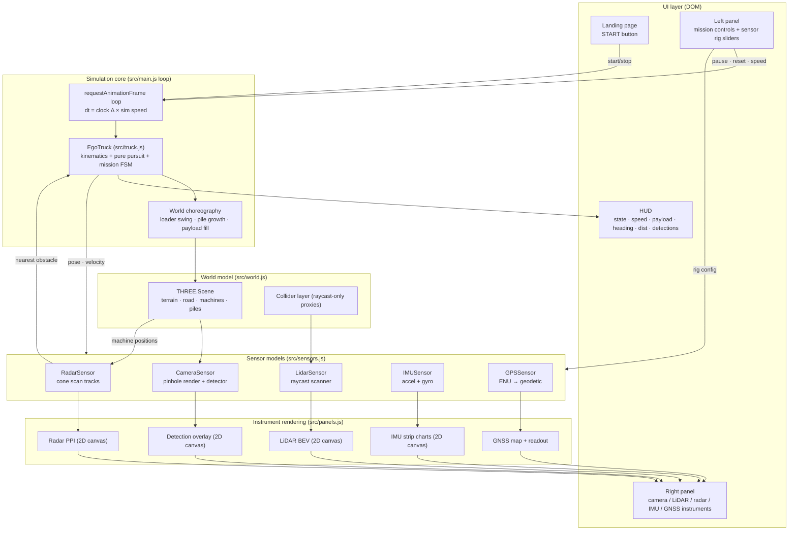
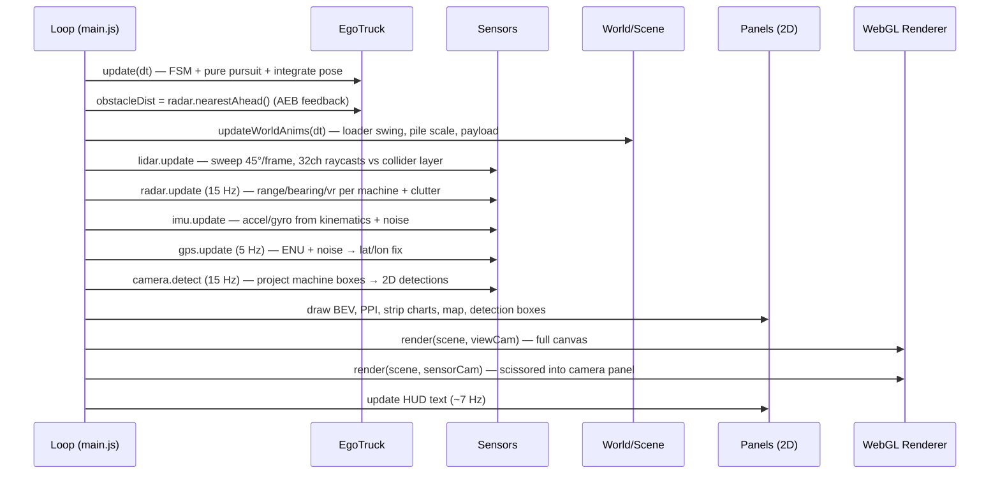
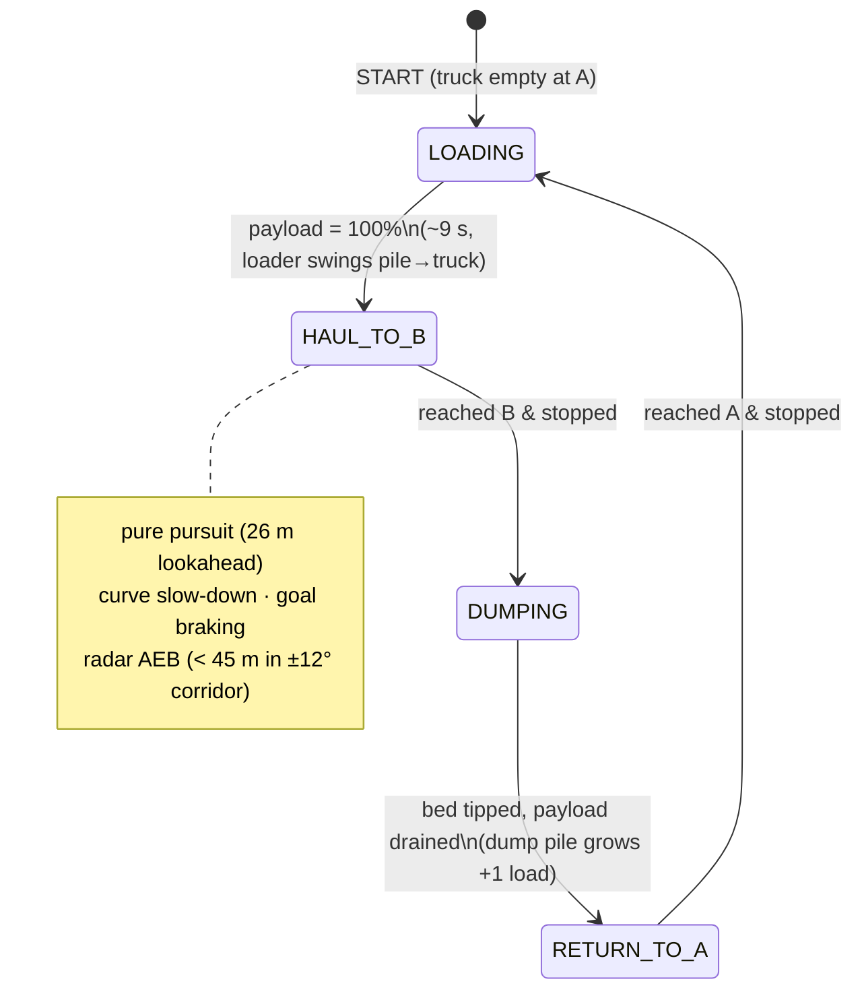

# AUSSIM — AUtonomy Site SIMulator

**AUSSIM** is a browser-based **perception + autonomy simulator** for an autonomous **CAT 797F haul truck**
operating on a **Boddington-style open-pit mine** — uneven terrain with a benched open pit, waste-dump
mound and rolling Jarrah-country hills. The truck runs a continuous production cycle —
**load at Point A → haul → dump at Point B → return** — while a full simulated sensor suite
(camera, LiDAR, radar, IMU, GNSS) streams live outputs to instrument panels, and other
Caterpillar machines (MTTT haul trucks, SCOM site-command unit, D11 dozers, 24M grader,
777 water truck, light towers) are randomly placed around the site.

> 📖 Deep-dive sensor documentation (implementation, design considerations, per-sensor
> architecture and flow diagrams): **[docs/sensor-documentation.html](docs/sensor-documentation.html)**

---

## Table of contents

1. [Quick start](#quick-start)
2. [Feature overview](#feature-overview)
3. [System architecture](#system-architecture)
4. [Runtime data flow](#runtime-data-flow)
5. [Mission state machine](#mission-state-machine)
6. [Sensor suite summary](#sensor-suite-summary)
7. [Controls & configuration](#controls--configuration)
8. [Module reference](#module-reference)
9. [Rendering design](#rendering-design)
10. [Headless verification hooks](#headless-verification-hooks)
11. [Mapping to a real autonomy stack](#mapping-to-a-real-autonomy-stack)

---

## Running locally (without Claude)

No cloud dependency — AUSSIM is a pure Node + browser app.

```bash
# 1. Install Node.js ≥ 18  (https://nodejs.org)
# 2. Clone / download the project, then inside the project directory:
npm install          # installs three + vite from package.json
npm run dev          # starts Vite dev server
# 3. Open your browser at:
#    http://localhost:5173
```

To stop the dev server press `Ctrl+C` in the terminal.
For a production build (static files you can serve anywhere):

```bash
npm run build        # outputs to dist/
npm run preview      # serves dist/ locally for a quick check
```

Prerequisites: **Node.js ≥ 18**, **npm ≥ 9**. No GPU, no Python, no backend required — everything runs in the browser via Three.js / WebGL.

## Quick start

```bash
npm install
npm run dev          # -> http://localhost:5173
```

Press **▶ START** on the landing page. Use **■ Stop** to end a run and return to the landing page, **❚❚ Pause / ▶ Run** to freeze/resume, **↺ Reset** to restart the mission without leaving the app.

Prerequisites are documented in [requirements.txt](requirements.txt)
(Node ≥ 18; packages: `three`, `vite`).

## Feature overview

| Area | What is simulated |
|---|---|
| **World** | Boddington-style uneven terrain (rolling hills, open pit with 4 terraced benches, waste-dump mound), S-curved haul road with berms, rocks, A/B markers, 10+ procedural CAT machines with floating ID labels |
| **Ego vehicle** | CAT 797F kinematics (accel/decel limits, yaw-rate limits), pure-pursuit path tracking, terrain-following pitch/roll/height, curve slow-down, goal braking, radar AEB |
| **Material cycle** | 6060 FS loader + stockpile at A fills the truck (visible payload heap, PAYLOAD % HUD); dump body tips at B and a pile grows one truck-load per trip |
| **Camera** | Real second render pass from a truck-mounted pinhole camera + projected 3D→2D detections (class, confidence, range) |
| **LiDAR** | 32-channel rotating raycaster; 3D point cloud in the world view + height-colored bird's-eye-view panel |
| **Radar** | FMCW-style cone scan; PPI scope with range / bearing / radial velocity tracks, RCS model, clutter false alarms |
| **IMU** | 6-DOF body-frame accelerations + gyro rates from vehicle kinematics with bias, noise, speed-dependent vibration |
| **GNSS** | RTK-grade geodetic fix (lat/lon/alt/COG/HDOP/sats) + mini-map with planned path and breadcrumb trail |
| **Sensor rig** | Live sliders to translate (lateral/height/forward) and rotate (pitch/yaw) every sensor, plus FOV/range; 3D gizmos show mounts and fields of view |

## System architecture



## Runtime data flow

One animation frame executes this pipeline (≈60 Hz, sensor-internal rates differ):



## Mission state machine



## Sensor suite summary

| Sensor | Rate | Model | Output surface |
|---|---|---|---|
| Camera | render every frame; detector 15 Hz | Pinhole `THREE.PerspectiveCamera` second render pass; oriented-bbox projection detector | Camera panel (live feed + boxes w/ class·conf·range), HUD detection count |
| LiDAR | ~7.5 Hz full revolution (45°/frame, 3° az, 32 ch) | `THREE.Raycaster` against invisible collider layer; range noise; height/intensity coloring | 3D point cloud in world view + BEV panel with range rings |
| Radar | 15 Hz | Analytic cone scan: range, bearing, radial velocity vs ego motion, log-RCS, 6% clutter | PPI wedge scope with sweep, blips, per-track range/vr labels |
| IMU | every physics step (nominal 200 Hz label) | ax = v·ω (centripetal), az = dv/dt, g + vibration ∝ speed, constant biases | 3 strip charts (lat accel, long accel, yaw rate) + |a| meta |
| GNSS | 5 Hz | Local ENU → WGS-84 around −23.3582°, 119.7521° (Pilbara); σ ≈ 3 cm (RTK) | Lat/Lon/Alt/VEL/COG/HDOP/sats readout + mini-map (path, A/B, trail) |

Full detail per sensor — inputs, equations, pipelines, pitfalls — in
**[docs/sensor-documentation.html](docs/sensor-documentation.html)**.

## Controls & configuration

**Mission control (left panel)**

- **❚❚ Pause / ▶ Run** — freeze/resume simulation (rendering continues)
- **■ Stop** — end the run, reset the mission, return to the landing page
- **↺ Reset** — restart the mission in place
- **Follow / Orbit / Top / Cab** — viewer camera modes (Orbit = mouse drag/zoom)
- **Sim speed** 0.25–3× · **Cruise speed** 4–25 m/s
- Toggles: LiDAR cloud in 3D · sensor gizmos/FOV

**Sensor rig config (left panel accordions)** — applied live every frame:

| Sensor | Position | Rotation | Other |
|---|---|---|---|
| Camera | lateral / height / forward (m) | pitch −45…30°, yaw ±180° | FOV 30–120° |
| LiDAR | lateral / height / forward (m) | yaw ±180° | range 40–200 m |
| Radar | lateral / height / forward (m) | pitch ±30°, yaw ±180° | range 40–250 m, FOV 20–160° |

**Reset sensor rig** restores factory mounts (`DEFAULT_RIG` in [src/sensors.js](src/sensors.js)).

## Module reference

```
index.html            landing page, HUD, panel layout
src/style.css         dark UI theme
src/main.js           renderer, loop, scissor multi-view, UI wiring, choreography, debug hooks
src/world.js          terrain, road, A/B markers, procedural CAT machines, piles, colliders, labels
src/truck.js          EgoTruck: kinematic model, pure-pursuit tracker, mission FSM, payload/dump
src/sensors.js        CameraSensor, LidarSensor, RadarSensor, IMUSensor, GPSSensor, DEFAULT_RIG
src/panels.js         2D canvas instruments: detections, LiDAR BEV, radar PPI, IMU charts, GPS map
src/ui.js             schema-driven slider/accordion construction
vite.config.js        dev server + snapshot-save middleware (verification helper)
docs/                 sensor documentation (HTML)
snapshots/            JPEGs written by the /__snap_save dev endpoint
```

## Rendering design

- **Single WebGL context, two render passes.** The main view renders full-canvas; the camera
  sensor renders the *same scene* into the camera panel using `setViewport`/`setScissor`
  aligned to the panel's DOM rect (three.js multiplies by pixel ratio internally).
- **Layer masks** separate concerns:
  - `0` — real geometry, visible to every camera
  - `1` — debug overlays (labels, LiDAR cloud, gizmos, frustum helper) — visible to the
    viewer camera only, so the sensor camera feed stays "physically clean"
  - `2` — invisible box/cone collider proxies used **only** by the LiDAR raycaster
    (~100 simple colliders instead of thousands of visual triangles)
- **Shadow camera follows the truck** (140 m box) so a 2 km world keeps crisp shadows.
- 2D instruments are plain `<canvas>` elements redrawn at 15 Hz, DPR-aware.

## Headless verification hooks

Debug-only globals (see end of [src/main.js](src/main.js)) let the sim be exercised without
a visible tab (rAF paused):

- `window.__advance(seconds)` — steps physics + sensors at fixed 60 Hz substeps, returns
  `{state, load, dumped, speed, pos, distToGoal, lidarPts, radarTrk}`
- `window.__snap(scale, quality)` — renders one frame synchronously and returns a JPEG dataURL
  composited from every canvas
- `POST /__snap_save?name=x` (dev server only) — writes that dataURL to `snapshots/x.jpg`

## Mapping to a real autonomy stack

This simulator is intentionally shaped like a robotics stack so components map 1:1 onto
production tooling:

| AUSSIM piece | Real-world equivalent |
|---|---|
| LiDAR point buffer (pos + intensity ring buffer) | `sensor_msgs/PointCloud2`, PCL / Open3D pipelines |
| Camera detector (projected boxes + confidence) | YOLO / Detectron2 inference on the RGB stream |
| BEV LiDAR panel | BEVFusion-style bird's-eye-view representation |
| Radar tracks (range, bearing, vr, RCS) | Automotive FMCW radar object lists (e.g. ARS548) |
| IMU + GNSS models | `sensor_msgs/Imu`, `sensor_msgs/NavSatFix`; EKF fusion (robot_localization) |
| Pure-pursuit tracker + FSM | ROS 2 Nav2 controller server + behavior tree |
| World + machine placement | CARLA / Gazebo / Isaac Sim scenario (OpenSCENARIO) |
| `__advance()` fixed-step hook | Sim-time stepping (`/clock`, `use_sim_time`) |

---

**AUSSIM (AUtonomy Site SIMulator)** © 2026 Lokanath. All rights reserved.
